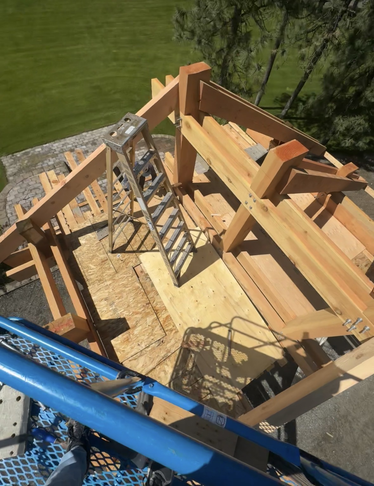
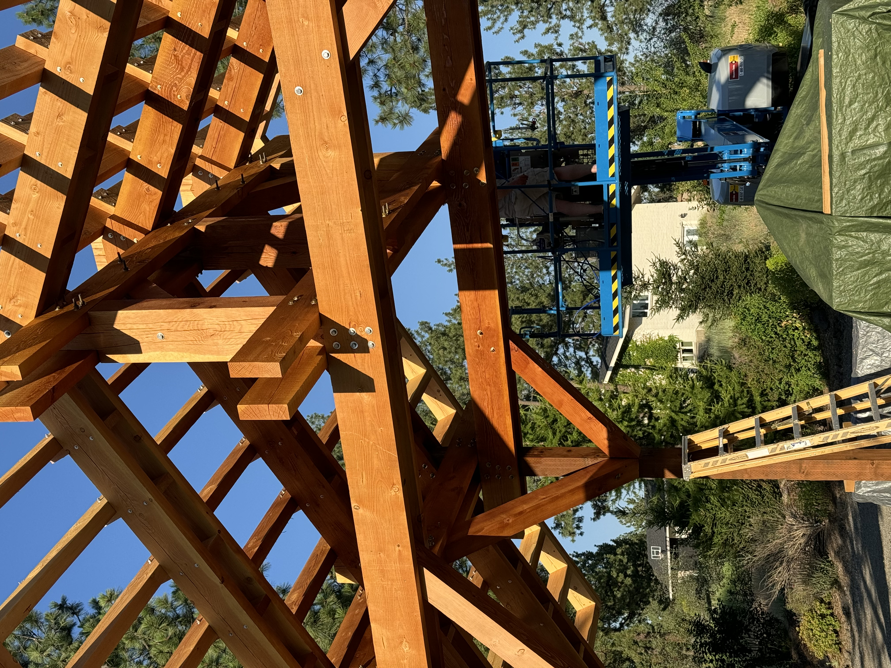
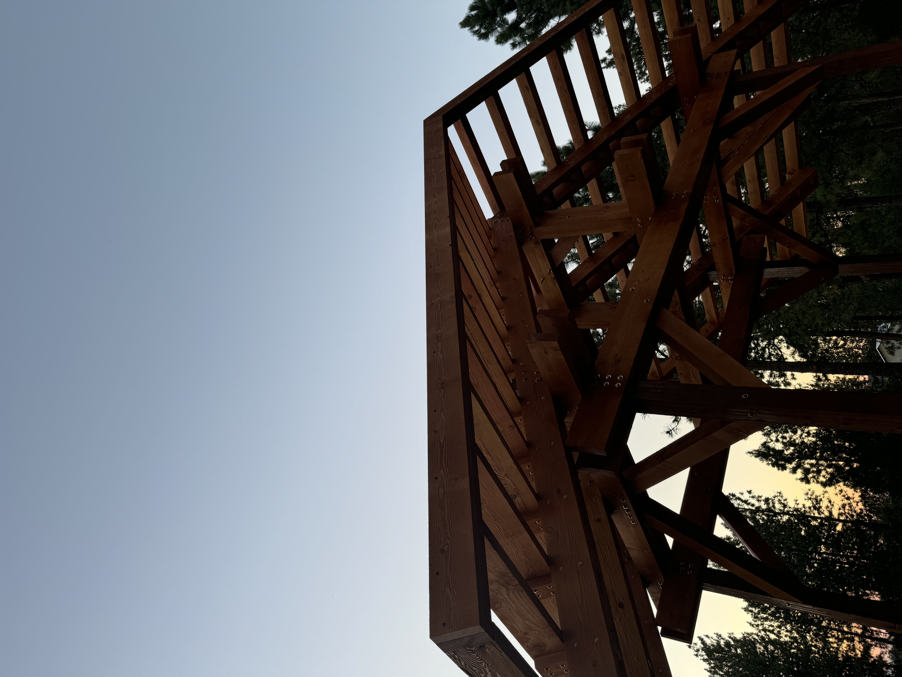
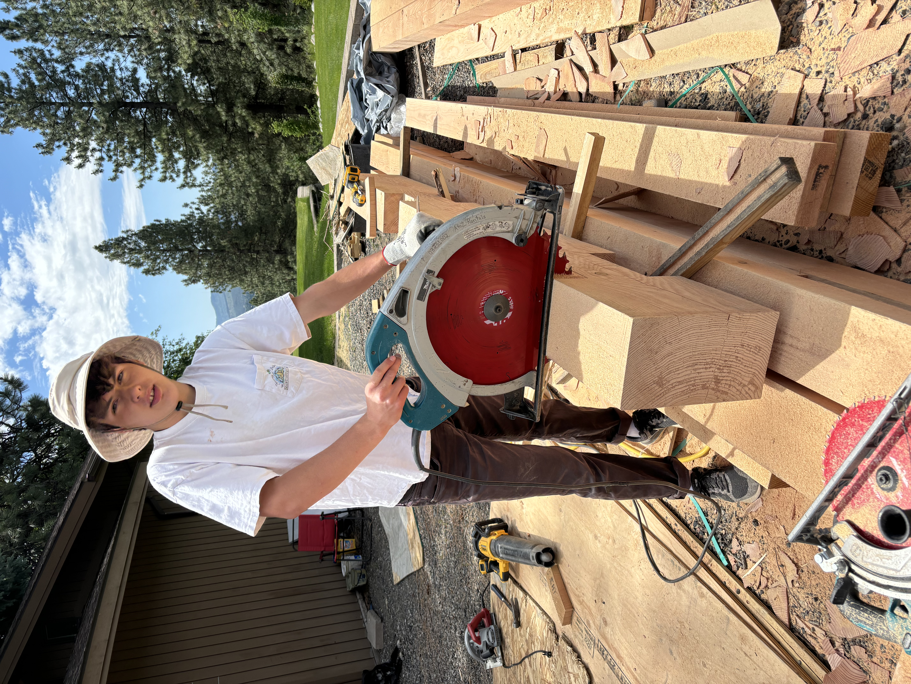
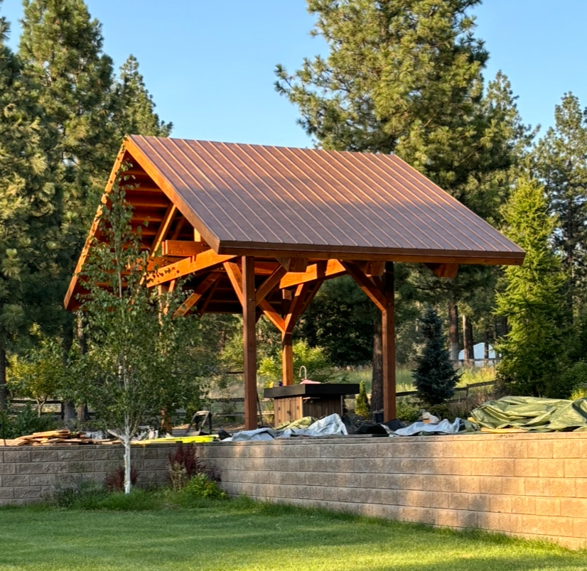
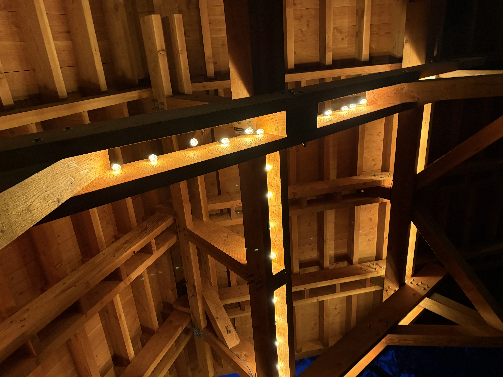
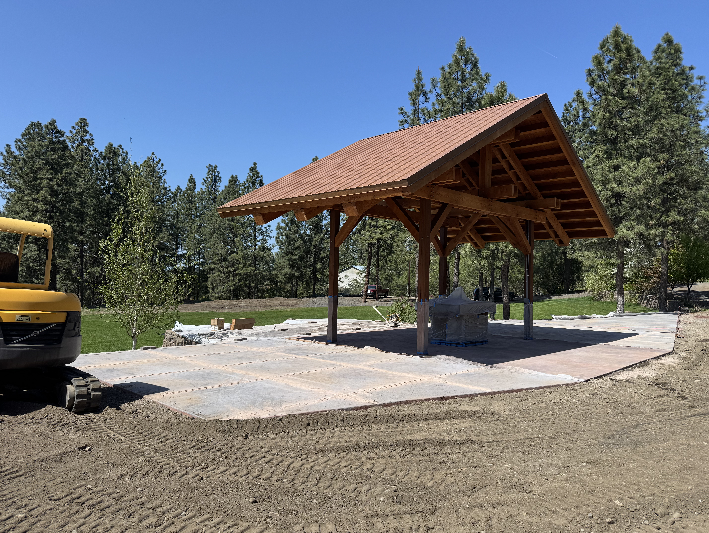
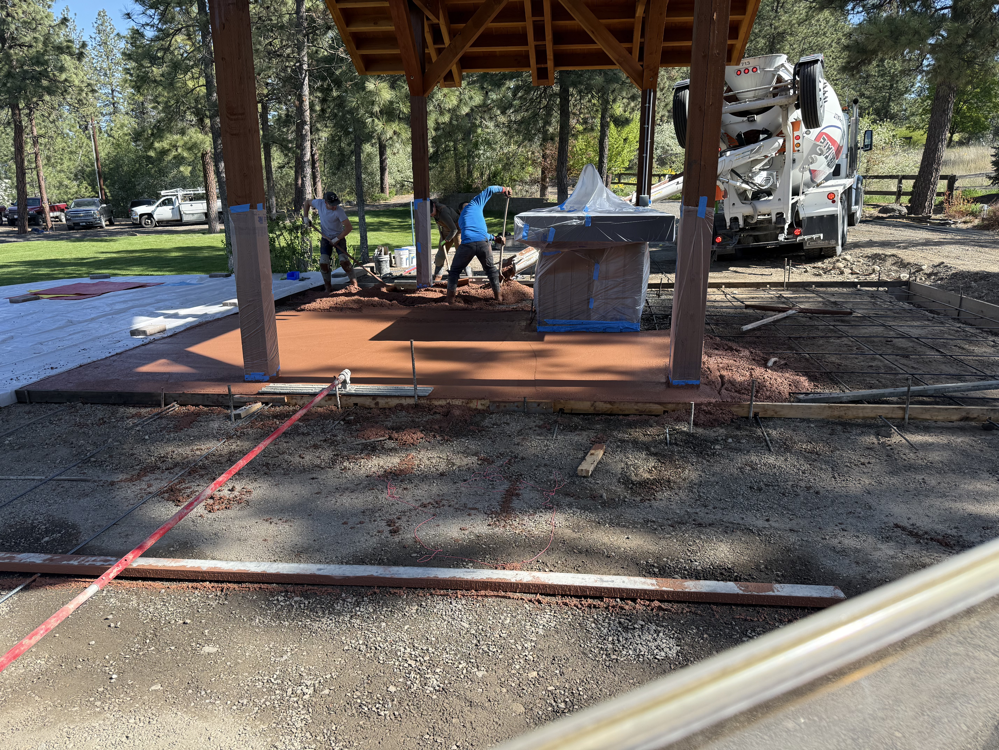
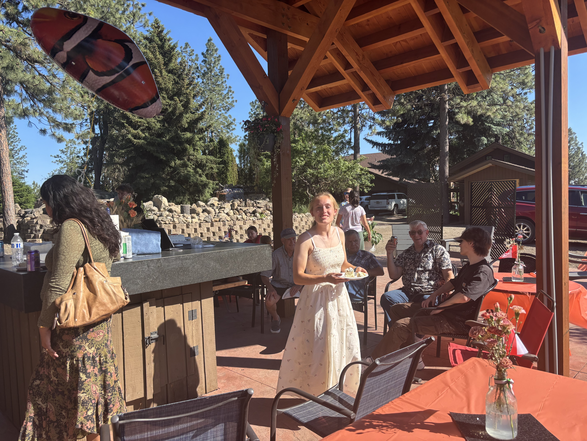

# Pavilion 3D Blueprints — From Survey to Built Structure


A complete design-to-construction record for a large outdoor pavilion: site reference, dimensional drawings, a detailed CAD assembly, Unity visualization, integrated electrical/audio planning, and photographs of the finished structure in use.

This was not only a modeling exercise. The pavilion was designed and constructed between May and July 2024, and the repository preserves the digital decisions that guided the physical build.


## Project scope

The pavilion uses a four-post frame and pitched roof over an approximately 34.63-foot north–south span and 20.42-foot east–west width. The model documents the primary posts, perimeter beams, joists, rafters, purlins, spacers, trim, diagonal reinforcement, roof surfaces, floor/site relationship, and equipment placement.

The planning set also records:

- approximately 21.27 feet of total structure height
- 56-inch below-grade post embedment
- 12 main roof rafters
- approximately 24-inch purlin-support spacing
- roof and cut geometry captured in dimensioned elevations
- underground power, switched circuits, XLR audio, and Cat6-compatible conduit routes

## Design workflow

### 1. Site and footprint

The satellite view establishes the pavilion's location and relationship to the surrounding hardscape before structure and roof details are considered.


### 2. Structural assembly

The roofless model exposes the load path and makes the intersecting beam, joist, rafter, spacer, and bracing systems easier to inspect.


### 3. Dimensioned roof planning

The roof drawing records pitch, rafter/purlin placement, overhangs, and key spacing values used to translate the 3D model into field measurements.


### 4. Elevation and below-grade planning

The side blueprint brings together above-grade height, post depth, roof peak, and framing relationships in one build reference.


### 5. Visualization and systems planning

The Unity project imports the pavilion and speaker models so the structure can be reviewed spatially. Custom scripts support camera movement and object visibility, while prefabs and transparent cone materials help visualize speaker placement/coverage. The repository also includes a proposal document and hundreds of Parasolid (`.x_t`) component exports from the CAD assembly.

## Construction and finished pavilion

The ten photographs below are intentionally presented as a 2 × 5 build gallery, moving from framing and fabrication to the completed gathering space.

<table>
  <tr>
    <td width="50%"><br><sub>Framing and joinery viewed from the lift.</sub></td>
    <td width="50%"><br><sub>Rafters, bracing, and intersecting members during construction.</sub></td>
  </tr>
  <tr>
    <td><br><sub>The pitched roof geometry taking shape.</sub></td>
    <td><br><sub>On-site fabrication translating dimensions into parts.</sub></td>
  </tr>
  <tr>
    <td><br><sub>Roof installation and the emerging full silhouette.</sub></td>
    <td><br><sub>Lighting integrated into the exposed timber structure.</sub></td>
  </tr>
  <tr>
    <td><br><sub>Completed shell with surrounding hardscape underway.</sub></td>
    <td><br><sub>Interior amenity and site work beneath the pavilion.</sub></td>
  </tr>
  <tr>
    <td><br><sub>The finished structure serving as a gathering space.</sub></td>
    <td><br><sub>Final front elevation and exposed timber frame.</sub></td>
  </tr>
</table>

## Structural and systems thinking

The project required coordination across disciplines. Frame geometry had to be buildable; roof members had to align across a large span; equipment and conduit had to be anticipated before finishes; and the digital model had to remain understandable enough to guide work in the field.

The result demonstrates a full feedback loop:

```text
site observation → measured model → dimensioned drawings → fabrication
       ↑                                                    ↓
       └──────────── verification against the build ────────┘
```

## Explore the repository

```text
.
├── Drawings/                          # Five presentation and blueprint views
├── Images/                            # Ten construction/final photographs
├── Pavilion 12.0 CAD/                 # Parasolid component exports
├── Assets/                            # Unity models, materials, prefabs, scripts, scenes
├── Packages/                          # Unity package manifest and lockfile
├── ProjectSettings/                   # Reproducible Unity project configuration
├── Pavilion obj.dae                   # Combined pavilion model export
└── Proposal.docx                      # Project proposal
```

Open the root folder as a Unity project to explore the visualization. CAD-capable software that supports Parasolid can inspect the individual `.x_t` components.

## Skills demonstrated

CAD assembly, architectural visualization, Unity, dimensional documentation, design-for-construction, field fabrication, electrical/audio systems planning, 3D asset integration, and carrying a complex project from concept through physical completion.
